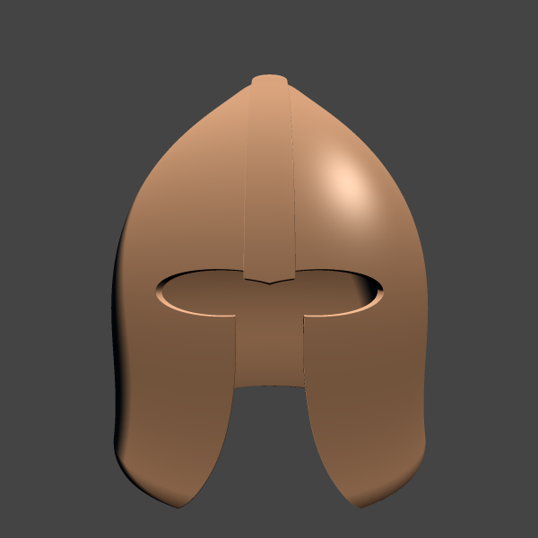

See the full source code [here](https://github.com/markusmoenig/ForgedThoughts/blob/master/examples/helmet.ft).

```rust
// Main shape - We make a smooth blend between a sphere and a cone

let sphere = Sphere(0.24);
let cone = Cone(0.3, 0.25, 0.0);

let helmet = smin(sphere, cone, 0.5);

// Assign the material

helmet.material.rgb = F3("9F6F4A");
helmet.material.metallic = 0.7;
helmet.material.roughness = 0.3;

// Make it hollow by creating a copy, subtract it and move it down a bit
// to open the bottom

let cut_out = helmet.copy();
cut_out.position.y -= 0.04;
cut_out.scale = 0.98;
helmet -= cut_out;

// Eye holes - We mirror an Ellipsoid on the x-axis and subtract it.

let eyes = Ellipsoid();
eyes.size = F3(0.11, 0.03, 0.1);
eyes.position = F3(0.06, -0.03, 0.3);
eyes.mirror.x = true;
helmet -= eyes;

// Nose and mouth - We modify a box and subtract it.

let cut = Box(F3(0.07, 0.2, 0.1));
cut.position.y -= 0.25;
cut.position.z = 0.2;

let modifier = RayModifier("x", "*", "sin", "y");
modifier.frequency = 10.0;
modifier.amplitude = 0.7;
modifier.addend = 1.0;
cut.modifier = modifier;
helmet -= cut;

// Stripe - We add a positive groove in the intersection between
// the helmet and a box.

let stripe = Box(F3(0.011, 0.17, 0.2));
stripe.position.y = 0.16;
stripe.position.z = 0.2;
helmet += Groove(stripe, 0.01, 0.02);
```