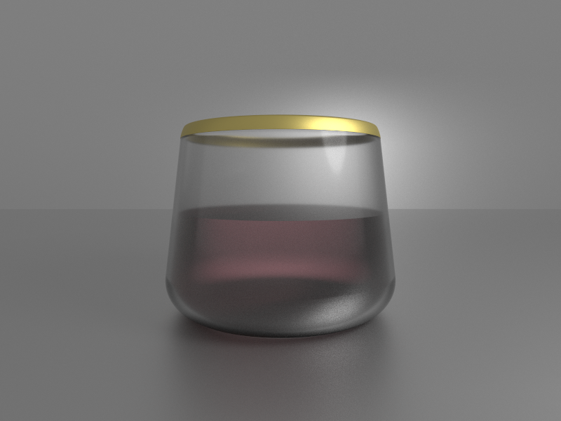

See the full source code [here](https://github.com/markusmoenig/ForgedThoughts/blob/master/examples/wine_glass.ft).

The modeling of the glass, except the materials, is just 9 lines.

```rust
// Glass

let glass = Cone(0.6, 0.7, 0.6);
glass.rounding = 0.2;

glass.material.rgb = F3(1.0, 1.0, 1.0);
glass.material.roughness = 0.0;
glass.material.transmission = 1.0;
glass.material.ior = 1.50;

let interior = glass.copy();
interior.scale = 0.96;

// Fluid

let fluid = interior.copy();
fluid.material.rgb = F3("722F37").to_linear();
fluid.material.transmission = 1.0;
fluid.material.roughness = 0.5;
fluid.material.ior = 1.3443705; // Red Wine
fluid.material.clearcoat_gloss = 1.0;
fluid.material.sheen = 1.0;
fluid.material.sheen_tint = 1.0;
fluid.max.y = 0.0;

glass -= interior;

// Top: Smooth Cut Off & Gold Rim

let box = Box();
box.material.rgb = F3("d4af37");
box.material.metallic = 1.0;
box.material.roughness = 0.2;
box.position.y = 1.5;

// Smoothly subtract the box from the glass
glass -= Smooth(box, 0.01);

// Create a groove with the gold material of the box
glass += Groove(box, 0.001, 0.07);
```