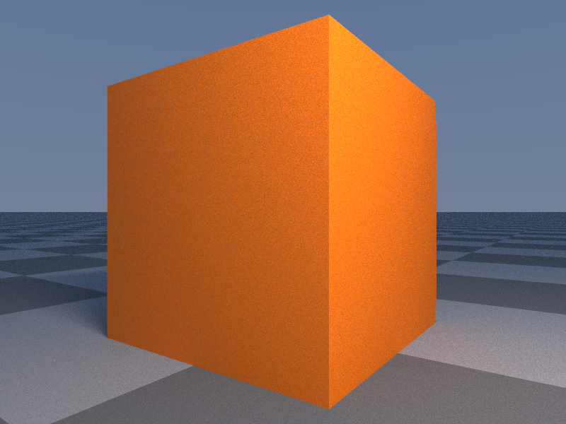
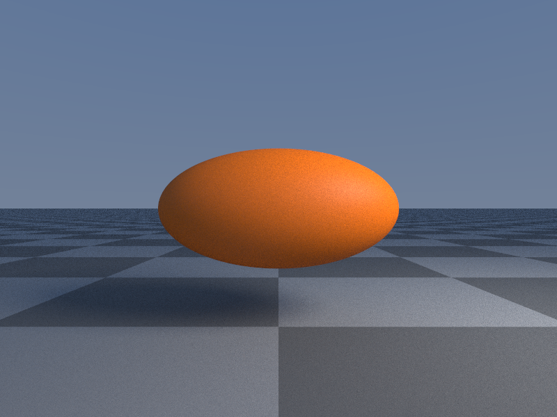

On overview of all currently available 3D SDFs (signed distance functions) classes and their properties and available transformations.

The SDFs will always be created at the center of the scene with a standard size of 1.0 by default.

## Transformations

```rust
// Change the position
v.position = F3(-1.0, 2.0, 3.0);
v.position.x += 2;

// Rotation
```

## Modifiers

```rust
v.rounding = 0.2;                       // Rounding of the SDF shape

v.mirror.x = true;                      // Mirror on the x-axis
v.mirror = B3(true, false, false);      // Same as above

v.visible = false;                      // Mark an SDF as invisible
```

## Available 3D SDFs

### Sphere

```rust
// Sphere
let v = Sphere();                       // Create a sphere with a radius of 1.0.
let v = Sphere(1.5);                    // Create a sphere with a custom radius
v.radius = 1.2;                         // Change the radius later
```


### Plane

```rust
// Plane
let v = Plane();                        // Creates a ground plane (normal is F3(0.0, 1.0, 0.0))
let v = Plane(F3(1.0, 0.0, 0.0), 0.0);  // Creates a plane based on a normal vector and an axis-offset
v.normal = F3(0.0, 1.0, 0,0);           // Changing the normal and offset manually
v.offset = -1.0;
```

### Box

```rust
// Box
let v = Box();                          // Create a box with a size of F3(1.0, 1.0, 1.0)
let v = Box(F3(1.0, 2.0, 3.0));         // Create a box with a custom size
v.size.x += 2.0;                        // Changing the size manually
```



### Cone / CappedCone

```rust
// Cone or CappedCone
// Defined by it's height and the radius of the bottom (lower_radius) and top (upper_radius).
let v = Cone();                         // Cone of height 1.0 and lower_radius = 1.0 and upper_radius = 0.0
let v = Cone(2.0, 1.5, 0.5);            // Cone of height 2.0 and lower_radius = 1.5 and upper_radius = 0.5
v.height = 0.5;                         // Changing values manually
v.lower_radius = 0.8;
v.upper_radius = 0.1;
```


### Ellipsoid

```rust
// Ellipsoid
let v = Ellipsoid();                    // Create an ellipsoid with a size of F3(1.0, 0.5, 0.5)
let v = Ellipsoid(F3(0.5, 0.2, 0.2));   // Create an ellipsoid with a custom size
v.size.x += 2.0;                        // Changing the size manually
```



### Torus

```rust
// Torus
// Defined by a radius and a ring_radius
let v = Torus();                        // radius of 0.7 and ring_radius of 0.3
let v = Torus(0.6, 0.2)                 // radius of 0.6 and a ring_radius of 0.2
v.radius = 0.6;                         // Changing values manually
v.ring_radius = 0.2;
```


### Cylinder

```rust
// Cylinder
// Defined by a height and a radius
let v = Cylinder();                     // height of 1.0 and radius of 0.5
let v = Cylinder(0.6, 0.2)              // height of 0.6 and a radius of 0.2
v.height = 0.6;                         // Changing values manually
v.radius = 0.2;
```


