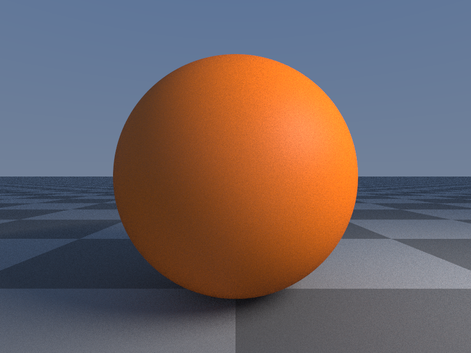

All top-level SDF shapes in a scene are automatically rendered.

For example

```rust
let sphere = Sphere();
```

would create a unit sphere.



For a list of all currently available SDFs consult the [reference](../../language/sdfs).

## Booleans

Boolean operations can be used by using the appropriate operator.

```rust
let sphere1 = Sphere(1.2);

let sphere2 = Sphere(1.2);
sphere2.position.x = 1.0;

sphere1 -= sphere2;
```

Would subtract sphere2 from sphere1.


In this case *sphere2* will not be rendered anymore as a standalone top-level object. However you can use *sphere2* by modifying it and subtracting or adding it to other objects.

There are many more boolean operations available and they can also support optional smoothing between the shapes. Read more in the [Booleans](../booleans/) chapter.

## Copying

You can make a copy of any shape with the copy function:

```rust
let sphere3 = sphere2.copy();
```

The copy will be a top-level object again and therefore be rendered.


When you copy an object, all existing boolean operations on that object will also be copied!
