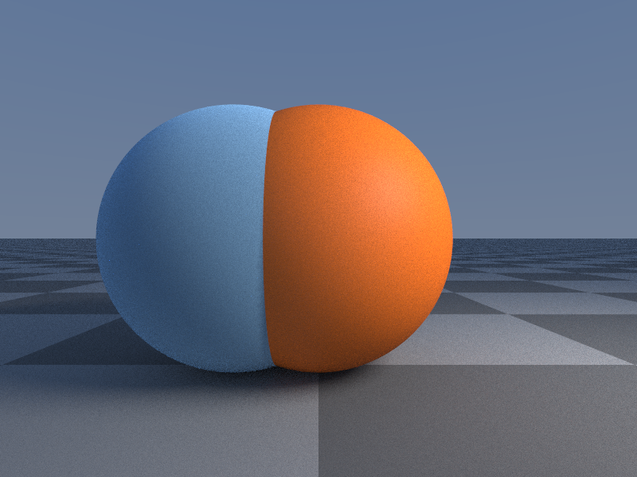
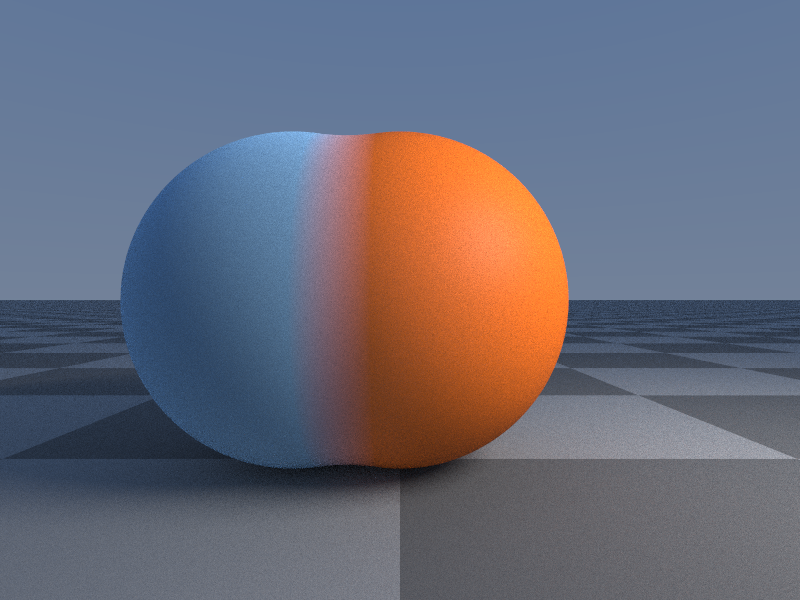
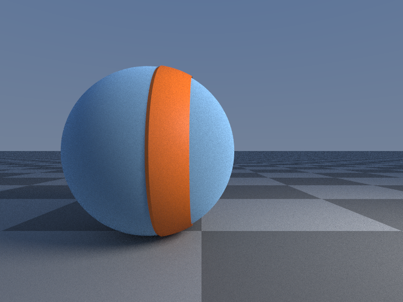
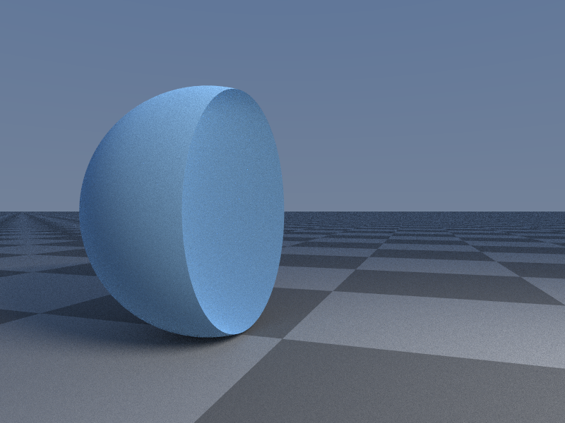
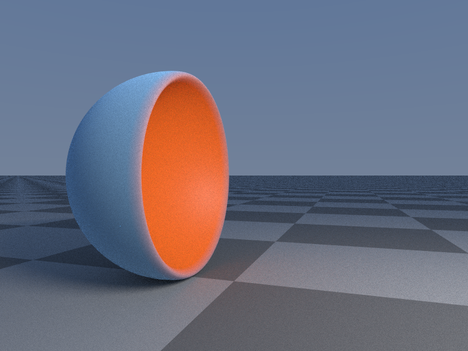
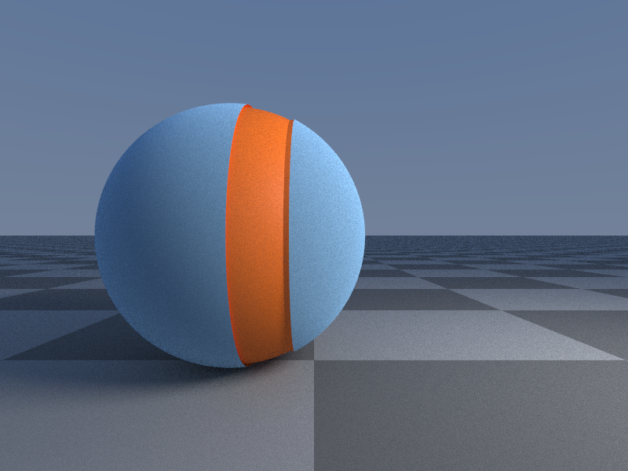
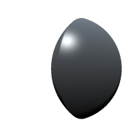
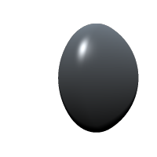

Use booleans to merge, subtract and intersect shapes with each other. These boolean operations come with quite a few options and operators.

## Addition

You can merge two shapes by just adding them:

```rust
let sphere1 = Sphere(1.2);
sphere1.material.rgb = F3(0.3);

let sphere2 = Sphere(1.2);
sphere2.position.x = 1.0;

sphere1 += sphere2;
```



The shape on the right is added to the shape on the left. This is actually the default operation for shapes, however you will need it when you want two add two shapes and then for example subtract them from another shape (together).

### Smoothing

You can also add a smooth factor by adding a ```Smooth``` operator:

```rust
sphere1 += Smooth(sphere2, 0.2);
```


The higher the smoothing factor the smoother and larger the shapes will become.

### Groove

Another operator is ```Groove``` which adds a positive groove to sphere1 where it intersects sphere2:

```rust
sphere1 += Groove(sphere2, 0.08, 0.2);
```



The first argument defines the height of the groove and with the second you can model its width. The groove operator is a very useful tool for adding detail.

## Subtraction

You can subtract two shapes like this:

```rust
sphere1 -= sphere2;
```



### Smoothing

And with a smoothing factor applied:

```rust
sphere1 -= Smooth(sphere2, 0.2);
```

The higher the smoothing factor the smoother the subtraction will become.



### Groove

 The ```Groove``` operator can also be used for subtraction:

```rust
sphere1 -= Groove(sphere2, 0.08, 0.2);
```



## Intersection

Intersection works similar:

```rust
sphere1 &= sphere2;
```



### Smoothing

And with smoothing:

```rust
sphere1 &= Smooth(sphere2, 0.2);
```



