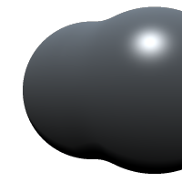
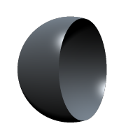
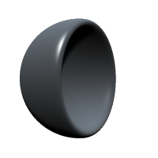

Use booleans to merge, subtract and intersect shapes with each other.

## Addition

You can merge two shapes by just adding them:

```rust
let sphere1 = Sphere(1.2);
sphere1.material.rgb = F3(0.3);

let sphere2 = Sphere(1.2);
sphere2.position.x = 1.0;

sphere1 += sphere2;
```


The shape on the right is added to the shape on the left. This is actually the default operation for shapes, however you will need it when you want two add two shapes and then for example subtract them from another shape (together).


You can also add a smooth factor by replacing the addition with this code:

```rust
sphere1 += Smooth(sphere2, 0.2);
```



The higher the smoothing factor the smoother and larger the shapes will become.

## Subtraction

You can subtract two shapes like this:

```rust
sphere1 -= sphere2;
```



And with a smoothing factor applied:

```rust
sphere1 -= Smooth(sphere2, 0.2);
```

The higher the smoothing factor the smoother the subtraction will become.



## Intersection

Intersection works similar:

```rust
sphere1 &= sphere2;
```


and with smoothing:

```rust
sphere1 &= Smooth(sphere2, 0.2);
```


