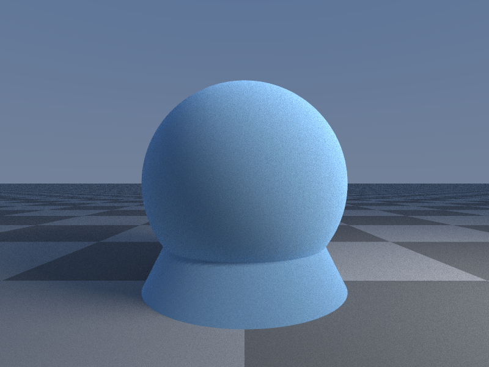
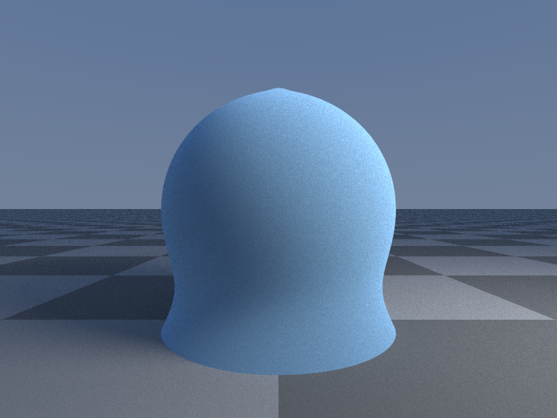

Forged Thoughts supports merging SDF primitives with the use of the smin() and smax() functions.

## smin

The smin() function in Forged Thoughts is based on the cubic polynomial smin function described by Inigo Quilez [here](https://iquilezles.org/articles/smin/).

Given we have two shapes:

```rust
let sphere = Sphere();
sphere.material.rgb = F3(0.2, 0.4, 0.6);
sphere.material.roughness = 1.0;
sphere.material.subsurface = 1.0;

let cone = Cone();
cone.material = sphere.material;
```



We can merge them with ```smin()``` into a new shape.

```rust
let result = smin(sphere, cone, 0.5);
```

where 0.5 is the weight between the two shapes.



## smax TBD
