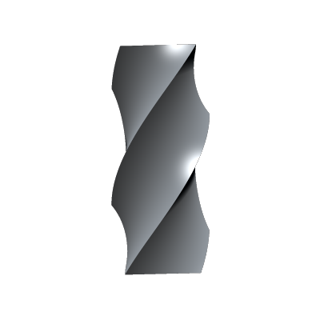
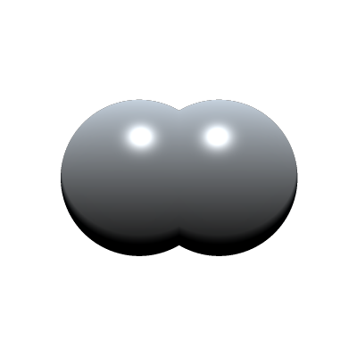

You can modify shapes in a lot of different ways. Some modifiers are built into the Forged Thoughts language itself, others you can program yourself.

Here we discuss all the modification tools available.

## Twist

You can twist a shape around an axis using it's twist property.

For example

```rust
let prim = Box(F3(0.3, 1.0, 0.3));

prim.material.rgb = F3(1.0, 0.186, 0.0);
prim.material.roughness = 0.3;

prim.twist.y = 2.0;

settings.step_size = 0.5;
```

will twist a box along the Y-axis and will look something like this:



Note that we reduced the step_size of the ray-marching in the global settings structure. The Twist operator distorts the distance field and because of this we need to shorten the ray step size.

## Mirror

You can mirror shapes along the x, y or z axis.

For example

```rust
let sphere = Sphere();

sphere.position.x += 0.6;
sphere.mirror.x = true;
```

will mirror the sphere at the x-axis. ```sphere.mirror``` is ```B3```, a vector of 3 booleans.


